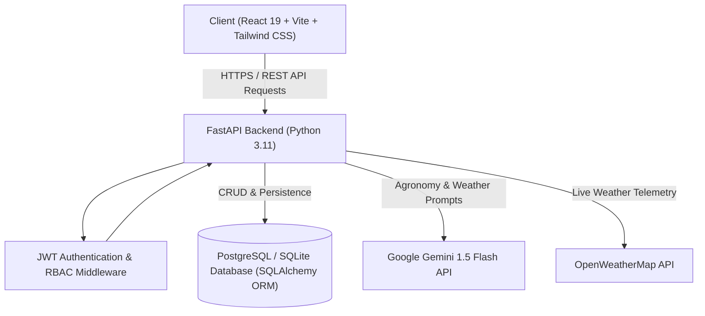

# 🌾 AgriConnect AI

### AI-Powered Smart Agriculture Platform

AgriConnect AI is a full-stack agricultural platform that combines crop management, AI-assisted agricultural guidance, plant disease detection, weather intelligence, and market-price analysis to help farmers make data-driven decisions.

---

## 🚀 Features

### 🌱 Crop Management
- Full CRUD operations for tracking crops across growth stages (`growing`, `harvested`, `stored`, `sold`).
- Filter crops by category, growth status, and geographic location.
- Pagination, search, and dual view modes (Data Table and Card Grid).
- Image upload support for crop records.

### 🤖 AI Agricultural Assistant
- Conversational agronomy assistant integrated with the **Google Gemini 1.5 Flash API** (with OpenAI GPT-4o-mini support and a local keyword fallback mode).
- Multi-turn conversation persistence stored in the database.
- Server-sent streaming response endpoint (`/api/ai/chat/stream`) for real-time text rendering.
- Markdown rendering with table and list support for agronomic instructions.

### 🔬 Plant Disease Diagnosis
- Leaf image upload interface supporting JPG, PNG, and WEBP formats.
- Diagnostic engine mapping crop types to known disease profiles and returning treatment plans.
- Structured output separating remedies into **Organic Solutions**, **Chemical Treatments**, and **Preventive Measures**.
- Persistent scan history linked to user accounts.

### 🌦️ Weather Intelligence
- Real-time weather data integration via the **OpenWeatherMap API** (temperature, humidity, wind velocity, precipitation risk).
- 7-day agricultural weather forecast.
- Automated generation of farming advisories (irrigation scheduling and foliar spray windows) based on live meteorological data using the Gemini API.

### 📈 Market Price Analysis & Forecast
- Price analysis for key commodities: Wheat, Rice, Tomato, Onion, Cotton, Grapes, and Potato.
- 12-month historical price trend visualization using Recharts.
- 30-day directional price projection with trend indicators (**Hold Stock** / **Sell Now**) and market commentary.

### 🏪 B2B Produce Marketplace
- Farmer portal to create, edit, and manage wholesale produce listings with custom quantities and unit pricing.
- Buyer portal to filter produce listings by crop category and region.
- Trade inquiry and order system with automated price calculations (`Quantity × Unit Price`).

### 🔐 Authentication & Role-Based Access
- User registration and login using JWT (JSON Web Tokens) and `passlib[bcrypt]` password hashing.
- Role-based access control supporting `farmer`, `buyer`, and `admin` roles.
- Profile management for updating user details, location, and contact information.

---

## 🧠 AI / ML Components

| Component | Problem Solved | Input | Technology / Model / API | Output | Integration Details |
| :--- | :--- | :--- | :--- | :--- | :--- |
| **Agricultural Assistant** | Provides contextual advice on soil, crop choices, fertilizers, and pests. | User text prompt + previous chat history | Google Gemini 1.5 Flash API (`gemini-1.5-flash:generateContent`) / OpenAI GPT-4o-mini | Formatted Markdown text response | FastAPI backend receives chat messages, appends conversation history from the DB, sends the payload to the Gemini API, and streams/saves the response. |
| **Weather Advisory Generator** | Converts raw weather metrics into actionable farming recommendations. | JSON weather payload (temperature, humidity, wind, rain chance) | Google Gemini 1.5 Flash API | Bulleted advisory covering irrigation, spraying, and pest risks | Backend fetches weather from OpenWeatherMap, injects the metrics into a prompt, calls Gemini, and attaches the advice to the weather response. |
| **Disease Diagnostic Service** | Identifies potential plant diseases and suggests remedies. | Uploaded leaf photo + crop type selection | Image storage pipeline + disease diagnostic knowledge base | Disease classification, confidence estimate, organic/chemical treatments, preventive steps | Image is uploaded to backend storage (`/static/uploads/scans/`); diagnostic service matches crop disease profiles and stores scan records in the database. |
| **Price Trend Forecaster** | Helps farmers decide whether to sell immediately or hold inventory. | Crop name / commodity selection | Heuristic time-series projection model with historical mandi baselines | 30-day target price, trend direction, confidence score, 12-month historical series | Backend evaluates seasonal baseline price indices, computes directional projection factors, and generates Recharts-compatible time-series datasets. |

---

## 🏗️ System Architecture



---

## 🛠️ Technology Stack

| Layer | Technology | Purpose |
| :--- | :--- | :--- |
| **Frontend UI** | React 19, Vite, Tailwind CSS v4 | Single Page Application interface |
| **Routing & State** | React Router v7, React Context API | Client-side routing and global auth/theme state |
| **Data Visualization** | Recharts | Interactive price trend and distribution charts |
| **Backend Framework** | FastAPI, Uvicorn | Asynchronous REST API server |
| **Data Validation** | Pydantic v2 | Request/response schema validation |
| **Database & ORM** | PostgreSQL (Supabase/Render) / SQLite, SQLAlchemy | Relational data persistence and schema migrations |
| **Security & Auth** | Python-Jose, Passlib (Bcrypt) | JWT token creation, verification, and password hashing |
| **External APIs** | Google Gemini API, OpenWeatherMap API | Generative AI advice and live meteorological data |
| **CI / CD** | GitHub Actions | Automated backend test and frontend build pipeline |
| **Hosting** | Vercel (Frontend), Render (Backend), Supabase (Database) | Cloud deployment infrastructure |

---

## 📂 Project Structure

```text
AgriConnect-Ai/
├── .github/
│   └── workflows/
│       └── ci.yml                 # GitHub Actions CI workflow (pytest + npm run build)
├── backend/
│   ├── core/
│   │   ├── deps.py                # Database session and auth dependency injection
│   │   ├── security.py            # JWT token encoding/decoding and bcrypt hashing
│   │   └── uploads.py             # File upload validation and disk storage handler
│   ├── routers/
│   │   ├── ai.py                  # AI chat & conversation endpoints
│   │   ├── auth.py                # User registration, login, profile management
│   │   ├── crops.py               # Crop inventory CRUD and filtering
│   │   ├── dashboard.py           # Dashboard statistics and summary telemetry
│   │   ├── disease.py             # Disease scan uploads and diagnostic history
│   │   ├── marketplace.py         # Produce listings, search, and order inquiries
│   │   ├── notifications.py       # User notification feed and read status
│   │   ├── price.py               # Mandi price trend and prediction endpoints
│   │   └── weather.py             # OpenWeatherMap proxy and AI weather advisory
│   ├── services/
│   │   ├── ai_config.py           # AI provider keys and system prompts
│   │   ├── ai_service.py          # Gemini/OpenAI API clients and streaming logic
│   │   ├── disease_service.py     # Plant disease diagnostic knowledge base
│   │   ├── price_service.py       # Price projection calculations and trend models
│   │   └── weather_service.py     # Weather API integration and response formatting
│   ├── tests/
│   │   ├── test_crops.py          # Service unit tests for disease and price modules
│   │   └── test_health.py         # API health check endpoint tests
│   ├── config.py                  # Environment variable configuration and CORS setup
│   ├── database.py                # SQLAlchemy engine setup and table migration script
│   ├── Dockerfile                 # Backend container configuration
│   ├── main.py                    # FastAPI application instance and router registration
│   ├── models.py                  # SQLAlchemy ORM database models
│   ├── requirements.txt           # Python dependencies
│   └── schemas.py                 # Pydantic schemas for request and response models
├── public/                        # Static web assets
├── src/
│   ├── components/
│   │   ├── dashboard/             # Dashboard charts, widgets, and activity panels
│   │   ├── landing/               # Landing page sections
│   │   ├── ui/                    # Reusable UI component library (Button, Modal, Card, etc.)
│   │   ├── Footer.jsx             # Application footer
│   │   ├── Navbar.jsx             # Responsive navigation header with dark mode toggle
│   │   ├── ProtectedRoute.jsx     # Route protection guard for authenticated pages
│   │   └── ThemeToggle.jsx        # Dark / light mode toggle
│   ├── context/
│   │   ├── AuthContext.jsx        # User authentication and session provider
│   │   └── ToastContext.jsx       # Global toast notification provider
│   ├── lib/
│   │   ├── api.js                 # Axios instance with auth interceptors
│   │   └── utils.js               # Formatting utilities (currency, date, classnames)
│   ├── pages/
│   │   ├── AIAssistant.jsx        # Conversational AI assistant interface
│   │   ├── About.jsx              # About page
│   │   ├── Crops.jsx              # Crop lifecycle management page
│   │   ├── Dashboard.jsx          # Analytics and summary dashboard
│   │   ├── DiseaseDetection.jsx   # Disease diagnostic photo upload page
│   │   ├── Home.jsx               # Landing page
│   │   ├── Login.jsx              # User login page
│   │   ├── Marketplace.jsx        # B2B produce marketplace and order management
│   │   ├── Notifications.jsx      # Notifications page
│   │   ├── PricePrediction.jsx    # Price forecasting and market trend analysis
│   │   ├── Profile.jsx            # User profile and preferences page
│   │   ├── Register.jsx           # User registration page
│   │   └── WeatherIntelligence.jsx# Live weather and agricultural advisory page
│   ├── providers/
│   │   └── AppProviders.jsx       # Combined context providers wrapper
│   ├── App.jsx                    # React Router configuration
│   ├── main.jsx                   # React application entrypoint
│   ├── index.css                  # Global styles and Tailwind configuration
│   └── App.css                    # Component-level utility styles
├── docker-compose.yml             # Local multi-container Docker Compose configuration
├── Dockerfile                     # Multi-stage production Nginx frontend Dockerfile
├── nginx.conf                     # Nginx reverse proxy configuration for frontend container
├── render.yaml                    # Render Blueprint deployment specification
├── vercel.json                    # Vercel SPA routing and cache header configuration
└── README.md                      # Project documentation
```

---

## ⚙️ Local Setup

### Prerequisites
- **Node.js**: v18.0 or higher
- **Python**: v3.11 or higher
- **Git**: Installed on your system

### 1. Clone the Repository
```bash
git clone https://github.com/manishachoudhary11/Agriconnect-Ai.git
cd Agriconnect-Ai
```

### 2. Backend Setup
```bash
cd backend
python -m venv venv

# On Windows:
venv\Scripts\activate
# On macOS/Linux:
source venv/bin/activate

pip install -r requirements.txt
```

Create a `.env` file in the `backend/` directory:
```env
DATABASE_URL=sqlite:///./agriconnect.db
SECRET_KEY=your_development_secret_key_here
ACCESS_TOKEN_EXPIRE_MINUTES=60
REFRESH_TOKEN_EXPIRE_DAYS=7
AI_PROVIDER=gemini
GEMINI_API_KEY=your_gemini_api_key_here
OPENWEATHER_API_KEY=your_openweather_api_key_here
CORS_ORIGINS=http://localhost:5173
```

Start the backend server:
```bash
uvicorn main:app --reload --port 8000
```
- API Base URL: `http://localhost:8000`
- Interactive API Docs (Swagger): `http://localhost:8000/docs`

### 3. Frontend Setup
Open a new terminal in the project root directory:
```bash
npm install
```

Create a `.env` file in the project root:
```env
VITE_API_URL=http://localhost:8000
```

Start the Vite development server:
```bash
npm run dev
```
- Frontend Application: `http://localhost:5173`

---

## 🐳 Docker Setup (Optional)

To run the complete system locally with Docker Compose:
```bash
docker-compose up --build -d
```
- Frontend: `http://localhost`
- Backend: `http://localhost:8000`
- PostgreSQL: `localhost:5432`

---

## 🔑 Environment Variables

### Backend (`backend/.env`)
| Variable | Required | Default | Description |
| :--- | :---: | :--- | :--- |
| `DATABASE_URL` | Yes | `sqlite:///./agriconnect.db` | PostgreSQL connection string or SQLite local database path |
| `SECRET_KEY` | Yes | `CHANGE_THIS_TO_A_LONG_RANDOM_SECRET` | Secret key used for signing JWT access tokens |
| `ACCESS_TOKEN_EXPIRE_MINUTES` | No | `30` | Expiration time for JWT access tokens in minutes |
| `REFRESH_TOKEN_EXPIRE_DAYS` | No | `7` | Expiration time for JWT refresh tokens in days |
| `AI_PROVIDER` | No | `mock` | Active AI provider (`gemini`, `openai`, or `mock`) |
| `GEMINI_API_KEY` | Optional | `""` | Google Gemini API key for live AI assistant responses |
| `OPENAI_API_KEY` | Optional | `""` | OpenAI API key (if `AI_PROVIDER=openai`) |
| `OPENWEATHER_API_KEY` | Optional | `""` | OpenWeatherMap API key for live weather data |
| `CORS_ORIGINS` | No | `http://localhost:5173` | Comma-separated list of allowed frontend origins |

### Frontend (`.env`)
| Variable | Required | Default | Description |
| :--- | :---: | :--- | :--- |
| `VITE_API_URL` | Yes | `http://127.0.0.1:8000` | Base URL of the FastAPI backend API |

---

## 🌐 Deployment

| Service | Platform | Link |
| :--- | :--- | :--- |
| **Frontend** | Vercel | [agriconnect-ai-tan.vercel.app](https://agriconnect-ai-tan.vercel.app) |
| **Backend API** | Render | [agri-backend-z07v.onrender.com](https://agri-backend-z07v.onrender.com) |
| **API Documentation** | Swagger UI | [agri-backend-z07v.onrender.com/docs](https://agri-backend-z07v.onrender.com/docs) |
| **Database** | Supabase | Cloud PostgreSQL instance |

---

## 🧪 Testing

### Backend Unit Tests
The backend uses `pytest` and `httpx` to test API routes and service modules.
```bash
cd backend
pytest tests/
```

### Frontend Build Verification
Verify that the React application compiles without bundle or lint errors:
```bash
npm run build
```

---

## 📌 Current Limitations

1. **Rule-Based Disease Diagnostic Mapping**: The disease detection module currently relies on structured diagnostic profiles and image uploads rather than an on-device, custom-trained convolutional neural network (CNN).
2. **Heuristic Price Model**: Price forecasting utilizes historical seasonal baseline indices and market multipliers rather than statistical time-series models (e.g., ARIMA or LSTM).
3. **External API Dependence**: AI conversation and live microclimate data depend on third-party availability (Google Gemini and OpenWeatherMap APIs), falling back to offline knowledge baselines when API quotas or keys are unavailable.
4. **Render Free Tier Spin-Down**: The free-tier backend hosted on Render may experience a cold-start delay (~30–50 seconds) if inactive for more than 15 minutes.


## 👨‍💻 Author

**Developed by Manisha Choudhary**  
GitHub: [https://github.com/manishachoudhary11](https://github.com/manishachoudhary11)  
Repository: [https://github.com/manishachoudhary11/Agriconnect-Ai](https://github.com/manishachoudhary11/Agriconnect-Ai)
