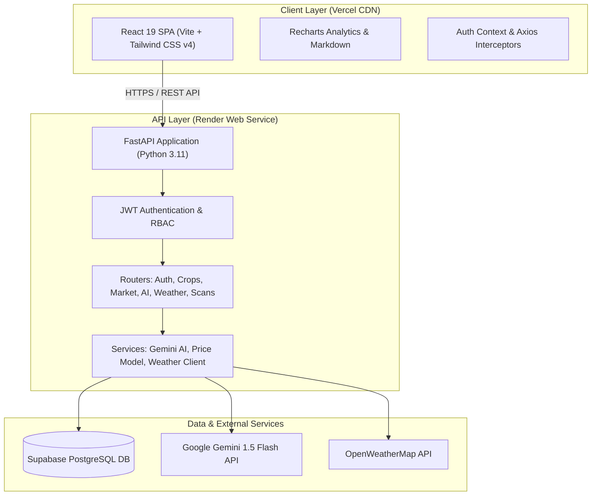

<div align="center">

# 🌾 AgriConnect AI 2.0
### Enterprise-Grade Smart Agriculture SaaS Platform

[](https://agriconnect-ai-tan.vercel.app)
[](https://agri-backend-z07v.onrender.com/docs)
[](https://github.com/manishachoudhary11/Agriconnect-Ai/actions)

<br/>

[](https://reactjs.org/)
[](https://fastapi.tiangolo.com/)
[](https://tailwindcss.com/)
[](https://deepmind.google/technologies/gemini/)
[](https://supabase.com/)
[](https://www.docker.com/)
[](LICENSE)

<p align="center">
  <b>AgriConnect AI 2.0</b> is a production-grade full-stack Smart Agriculture SaaS platform connecting farmers, agronomists, and wholesale buyers. Powered by <b>Google Gemini 1.5 Flash</b>, <b>OpenWeather microclimate intelligence</b>, and <b>predictive Mandi market analytics</b>, AgriConnect AI transforms agricultural data into profitable farm decisions.
</p>

[Explore Live Demo](https://agriconnect-ai-tan.vercel.app) · [View API Docs](https://agri-backend-z07v.onrender.com/docs) · [Report Bug](https://github.com/manishachoudhary11/Agriconnect-Ai/issues)

</div>

---

## 🌟 Live Deployments

| Component | Platform | Live URL | Status |
| :--- | :--- | :--- | :---: |
| **Frontend Web App** | Vercel Global Edge | [agriconnect-ai-tan.vercel.app](https://agriconnect-ai-tan.vercel.app) |  |
| **Backend REST API** | Render Web Service | [agri-backend-z07v.onrender.com](https://agri-backend-z07v.onrender.com) |  |
| **Interactive API Docs** | Swagger / OpenAPI | [agri-backend-z07v.onrender.com/docs](https://agri-backend-z07v.onrender.com/docs) |  |
| **Managed Database** | Supabase (PostgreSQL) | Managed Cloud DB Instance |  |

---

## 🚀 Key Modules & Features

### 1. 📊 Executive Farm Command Dashboard
- **Live Telemetry Cards**: Real-time metrics for Active Crops, Total Yield Volume, Average Mandi Price, and AI Crop Health Score.
- **Interactive Recharts Visualizations**: Dark-mode gradient price trend area charts and crop inventory distribution donut charts.
- **Dynamic Weather & AI Advisory**: Weather summary widget paired with prioritized AI recommendations.

### 2. 🌱 Crop Lifecycle Management Engine
- **Full CRUD Operations**: Create, view, edit, and track crop inventories across lifecycle stages (`growing`, `harvested`, `stored`, `sold`).
- **Data Filtering**: Debounced instant search, category filters, server-side pagination, and Grid vs Table view toggles.
- **Image Attachments**: Crop photo uploads with direct image preview.

### 3. 🏪 B2B Produce Marketplace
- **Farmer Portal**: Publish, manage, update, and remove wholesale produce listings.
- **Buyer Discovery**: Filter wholesale listings by produce category, geographic location, and unit price.
- **Trade & Inquiry Hub**: Direct buyer-seller transaction inquiries with real-time price calculations (`Quantity × Unit Price`).

### 4. 🤖 AI Agronomist Assistant (Gemini 1.5 Flash)
- **Multi-Turn Conversational Memory**: Context-aware agronomy advice with conversation history persistence (`/api/ai/conversations`).
- **Markdown & Code Rendering**: Formatted responses with [`react-markdown`](https://github.com/remarkjs/react-markdown) and [`remark-gfm`](https://github.com/remarkjs/remark-gfm).
- **Interactive UX**: Quick suggested prompt pills, typing animation indicators, and auto-scroll chat window.

### 5. 🔬 Plant Disease Diagnostic Scanner
- **Photo Diagnostic Tool**: Drag-and-drop leaf photo diagnostic scanner with image preview.
- **Treatment Breakdown**: Actionable remediation steps divided into **Organic Solutions**, **Chemical Treatments**, and **Preventive Measures**.
- **Historical Scan Log**: Persistent diagnostic history per farmer account.

### 6. 🌦️ Microclimate Weather Intelligence
- **Live Atmospheric Metrics**: Real-time temperature, feels-like, humidity, wind velocity, and precipitation risk.
- **7-Day Agricultural Forecast**: Multi-day outlook tailored for farm operations.
- **AI Irrigation & Spray Advisory**: Contextual recommendations for optimal watering and foliar spraying windows.

### 7. 📈 Mandi Price Prediction & Market Analytics
- **30-Day Price Forecast**: Predictive market trends with confidence scores.
- **Trading Decision Badges**: Smart **HOLD STOCK** or **SELL NOW** recommendation indicators.
- **12-Month Historical Analysis**: Recharts area visualization tracking seasonal commodity price movements.

### 8. 🔐 Authentication, RBAC & Profile Center
- **Security**: JWT-based token authentication with bcrypt password hashing.
- **Role-Based Access Control**: Tailored experiences for `farmer`, `buyer`, and `admin` roles.
- **Offline Demo Resilience**: Built-in client-side fallback handling for uninterrupted offline demonstrations.

---

## 🏗️ System Architecture



---

## 🛠️ Technology Stack

| Layer | Technologies Used | Purpose |
| :--- | :--- | :--- |
| **Frontend** | React 19, Vite, Tailwind CSS v4 | Ultra-fast, modern reactive UI |
| **State & Data** | Context API, Axios Interceptors, Zod | Centralized auth & resilient API handling |
| **Data Viz** | Recharts, React Icons, React Markdown | Interactive analytics & formatted AI chat |
| **Backend API** | FastAPI, Uvicorn, Pydantic v2 | High-performance asynchronous REST API |
| **Security** | Python-Jose, Passlib (Bcrypt) | JWT token creation & secure password hashing |
| **Database & ORM** | PostgreSQL (Supabase), SQLAlchemy | Relational data persistence & migrations |
| **AI Integration** | Google Gemini 1.5 Flash API | Conversational agronomy intelligence |
| **DevOps & CI/CD** | Docker, Nginx, GitHub Actions | Containerization & automated testing |
| **Hosting** | Vercel (Frontend), Render (Backend) | Production cloud deployment |

---

## 📂 Folder Architecture

```text
AgriConnectAI/
├── .github/
│   └── workflows/
│       └── ci.yml                 # Automated GitHub Actions CI/CD pipeline
├── backend/
│   ├── core/                      # Security (JWT, bcrypt), deps, upload helpers
│   ├── routers/                   # FastAPI endpoints (auth, crops, dashboard, market, ai, disease, weather, price)
│   ├── services/                  # Business logic (Gemini AI, disease, price, weather)
│   ├── tests/                     # Pytest backend test suite
│   ├── config.py                  # Environment config & dynamic CORS
│   ├── database.py                # SQLAlchemy engine & auto-migration engine
│   ├── Dockerfile                 # Backend container specification
│   ├── main.py                    # FastAPI entrypoint & router registry
│   ├── models.py                  # SQLAlchemy relational database models
│   ├── requirements.txt           # Python production dependencies
│   └── schemas.py                 # Pydantic v2 request/response schemas
├── public/                        # Static assets
├── src/
│   ├── components/
│   │   ├── dashboard/             # Recharts widgets & dashboard components
│   │   ├── landing/               # High-converting landing page sections
│   │   ├── ui/                    # Reusable UI component library (Button, Modal, Badge, etc.)
│   │   ├── Footer.jsx             # App footer
│   │   ├── Navbar.jsx             # Responsive navbar with dark/light mode toggle
│   │   └── ProtectedRoute.jsx     # JWT auth route guard
│   ├── context/                   # AuthContext & ThemeProvider
│   ├── lib/                       # Axios client & formatting utilities
│   ├── pages/                     # Application pages (Dashboard, Crops, Marketplace, AI, etc.)
│   ├── App.jsx                    # React Router configuration
│   └── main.jsx                   # React DOM entrypoint
├── DEPLOYMENT.md                  # Comprehensive production deployment guide
├── docker-compose.yml             # Local multi-container orchestration spec
├── Dockerfile                     # Multi-stage production Nginx frontend Dockerfile
├── nginx.conf                     # Nginx reverse proxy configuration
├── render.yaml                    # Render Blueprint infrastructure manifest
├── vercel.json                    # Vercel SPA rewrite & caching manifest
└── README.md                      # Project documentation
```

---

## ⚙️ Quick Start & Local Setup

### Prerequisites
- **Node.js**: v18.0+ or v20.0+
- **Python**: v3.11+
- **Git**: Installed on your machine

### 1. Clone the Repository
```bash
git clone https://github.com/manishachoudhary11/Agriconnect-Ai.git
cd Agriconnect-Ai
```

### 2. Backend Setup
```bash
cd backend
python -m venv venv

# On Windows:
venv\Scripts\activate
# On macOS/Linux:
source venv/bin/activate

pip install -r requirements.txt
```

Create a `.env` file in the `backend/` directory:
```env
DATABASE_URL=sqlite:///./agriconnect.db
SECRET_KEY=super_secret_jwt_key_for_development_only
ACCESS_TOKEN_EXPIRE_MINUTES=60
REFRESH_TOKEN_EXPIRE_DAYS=7
AI_PROVIDER=gemini
GEMINI_API_KEY=your_google_gemini_api_key
CORS_ORIGINS=http://localhost:5173
```

Start the FastAPI server:
```bash
uvicorn main:app --reload --port 8000
```
- API Endpoint: `http://localhost:8000`
- Interactive Swagger Docs: `http://localhost:8000/docs`

### 3. Frontend Setup
In the project root directory:
```bash
npm install
npm run dev
```
- Web Application: `http://localhost:5173`

---

## 🐳 Docker Deployment

Run the complete full-stack environment (PostgreSQL + FastAPI Backend + Nginx React Frontend) with a single command:

```bash
docker-compose up --build -d
```

- Frontend App: `http://localhost`
- Backend API: `http://localhost:8000`
- Database: `localhost:5432`

---

## 🧪 Testing & Quality Assurance

### Run Backend Unit Tests
```bash
cd backend
pytest tests/
```

### Run Frontend Production Build Check
```bash
npm run build
```

---

## 🔒 Environment Variables Reference

| Variable Name | Location | Required | Description |
| :--- | :--- | :---: | :--- |
| `DATABASE_URL` | Backend | **Yes** | PostgreSQL connection string or SQLite path |
| `SECRET_KEY` | Backend | **Yes** | Cryptographic secret for signing JWT tokens |
| `GEMINI_API_KEY` | Backend | Optional | Google Gemini 1.5 Flash API Key |
| `OPENWEATHER_API_KEY`| Backend | Optional | OpenWeatherMap API Key for live weather |
| `CORS_ORIGINS` | Backend | **Yes** | Allowed frontend domains (comma-separated or `*`) |
| `VITE_API_URL` | Frontend | **Yes** | Base URL pointing to the FastAPI backend API |

---

## 👥 User Roles & Personas

- 👨‍🌾 **Farmer**: Add & manage crop inventories, list produce on marketplace, access AI diagnostics, monitor weather advisories.
- 🏢 **Buyer**: Discover wholesale farm produce, filter by location/commodity, submit purchase trade inquiries.
- 🛡️ **Admin**: Oversee platform activity, manage listings, and audit transactions.

---

## 📜 License
This project is open-source and available under the [MIT License](LICENSE).

---

<div align="center">
  <b>Built with ❤️ for modern, data-driven smart agriculture.</b><br/>
  <sub>Developed by <a href="https://github.com/manishachoudhary11">Manisha Choudhary</a></sub>
</div>
